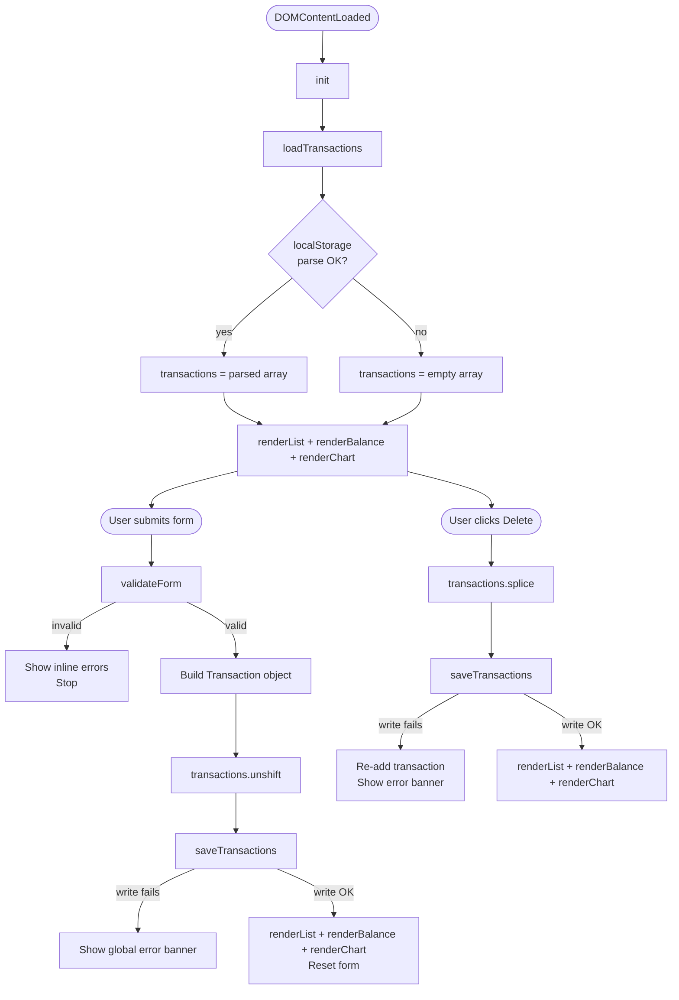
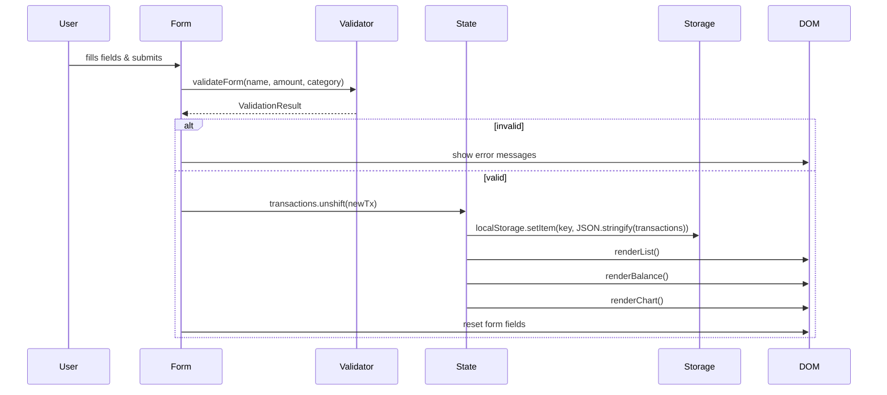

# Design Document: Expense & Budget Visualizer

## Overview

The Expense & Budget Visualizer is a zero-dependency, single-page web application that runs entirely in the browser. Users record expense transactions (name, amount, category), view a live-updating total balance, scroll through a deletable transaction history, and inspect spending distribution through an interactive Chart.js pie chart. All data is persisted in `localStorage` — no backend, no build step, no framework.

The application is delivered as three files:

| File | Role |
|---|---|
| `index.html` | Page skeleton, CDN link for Chart.js, structural markup |
| `css/style.css` | All visual styling, responsive breakpoints, component states |
| `js/script.js` | All application logic — state, validation, DOM rendering, chart, persistence |

### Key Constraints

- Vanilla JavaScript only (no React, Vue, Angular, or equivalent).
- Chart.js loaded from CDN — no local install.
- No build tools or package managers needed; open `index.html` directly in a browser.
- All data stored exclusively in `localStorage` under a single fixed key.

---

## Architecture

The application follows a **unidirectional data-flow** pattern implemented with plain JS:

```
User Action
    │
    ▼
Event Handler (in app.js)
    │
    ▼
State Mutation  ──►  Persistence (localStorage.setItem)
    │
    ▼
Re-render (DOM + Chart)
```

There are no reactive bindings. Every user action triggers a full re-render of the affected UI region (transaction list, balance display, and chart). Because the dataset is capped in practical use at a few hundred rows, full re-render on each action is fast and avoids stale-state bugs.

### Module Boundaries (inside `js/script.js`)

Although everything lives in one file, the code is organised into clearly separated logical sections separated by block comments:

| Section | Responsibility |
|---|---|
| **Constants** | Storage key, category list, validation limits |
| **State** | Single `transactions` array — the sole source of truth |
| **Persistence** | `loadTransactions()`, `saveTransactions()` with try/catch |
| **Validation** | `validateForm()` returning structured error objects |
| **Renderer – List** | `renderList()` — builds transaction list DOM |
| **Renderer – Balance** | `renderBalance()` — updates balance display |
| **Renderer – Chart** | `renderChart()` — creates/updates Chart.js pie chart |
| **Event Handlers** | Form submit, delete button delegation |
| **Init** | `init()` — bootstraps on `DOMContentLoaded` |

---

## Components and Interfaces

### 1. HTML Structure (`index.html`)

```
<body>
  <header>
    <h1>Expense & Budget Visualizer</h1>
    <div id="balance-container">
      <span id="balance-label">Total Spent:</span>
      <span id="balance-value">0.00</span>
    </div>
  </header>

  <main>
    <section id="form-section">
      <form id="transaction-form">
        <div class="field-group">
          <label for="item-name">Item Name</label>
          <input id="item-name" type="text" maxlength="100" autocomplete="off" />
          <span class="error-msg" id="item-name-error" aria-live="polite"></span>
        </div>

        <div class="field-group">
          <label for="amount">Amount</label>
          <input id="amount" type="number" step="0.01" min="0.01" max="999999999.99" />
          <span class="error-msg" id="amount-error" aria-live="polite"></span>
        </div>

        <div class="field-group">
          <label for="category">Category</label>
          <select id="category">
            <option value="" disabled selected>Select a category</option>
            <option value="Food">Food</option>
            <option value="Transport">Transport</option>
            <option value="Fun">Fun</option>
          </select>
          <span class="error-msg" id="category-error" aria-live="polite"></span>
        </div>

        <button type="submit">Add Transaction</button>
      </form>
    </section>

    <section id="chart-section">
      <canvas id="pie-chart"></canvas>
    </section>

    <section id="list-section">
      <h2>Transactions</h2>
      <ul id="transaction-list" aria-live="polite">
        <!-- Populated by renderList() -->
      </ul>
    </section>
  </main>
</body>
```

**Notes:**
- `aria-live="polite"` on error spans ensures screen readers announce validation messages without interrupting the user.
- `aria-live="polite"` on the transaction list ensures additions/removals are announced.
- `<canvas id="pie-chart">` is the Chart.js mounting point.

### 2. State Object

```js
// js/script.js

const STORAGE_KEY = 'expense_budget_transactions';
const CATEGORIES  = ['Food', 'Transport', 'Fun'];

/**
 * @typedef {Object} Transaction
 * @property {string} id        - Unique identifier (crypto.randomUUID or Date.now().toString())
 * @property {string} name      - Item name (1–100 chars)
 * @property {number} amount    - Positive number (0.01 – 999999999.99)
 * @property {string} category  - One of CATEGORIES
 */

/** @type {Transaction[]} */
let transactions = [];
```

The `transactions` array is the single source of truth. `localStorage` is a serialization target — it is never read after initialization.

### 3. Validation Interface

```js
/**
 * @typedef {Object} ValidationResult
 * @property {boolean} valid
 * @property {{ itemName?: string, amount?: string, category?: string }} errors
 */

/**
 * Validates form input values.
 * @param {string} name
 * @param {string} rawAmount  - raw string value from input
 * @param {string} category
 * @returns {ValidationResult}
 */
function validateForm(name, rawAmount, category) { … }
```

Rules enforced:
- `name`: non-empty string, length ≤ 100.
- `rawAmount`: parses as a finite number, value in [0.01, 999999999.99].
- `category`: must be one of `CATEGORIES`.

### 4. Persistence Interface

```js
/** Reads and deserializes transactions from localStorage. Returns [] on any error. */
function loadTransactions() { … }

/** Serializes current state to localStorage. Returns false and shows error on failure. */
function saveTransactions() { … }
```

Both functions wrap localStorage access in `try/catch` to handle QuotaExceededError and SecurityError (e.g., private-browsing restrictions in some browsers).

### 5. Renderer Interfaces

```js
/** Full re-render of the transaction list <ul>. */
function renderList() { … }

/** Updates #balance-value text. */
function renderBalance() { … }

/**
 * Creates the chart on first call; updates data on subsequent calls.
 * Destroys and re-creates if categories change (Chart.js constraint).
 */
function renderChart() { … }
```

### 6. Chart.js Integration

Chart.js v4 is loaded via CDN:

```html
<script src="https://cdn.jsdelivr.net/npm/chart.js@4/dist/chart.umd.min.js"></script>
```

The chart is managed through a module-level variable:

```js
/** @type {import('chart.js').Chart | null} */
let pieChart = null;
```

**Update Strategy:**  
On each `renderChart()` call:
1. Compute per-category totals from `transactions`.
2. Filter out categories with a total of 0.
3. If `pieChart` is `null`, create a new `Chart` instance.
4. Otherwise, mutate `pieChart.data.labels`, `pieChart.data.datasets[0].data`, and call `pieChart.update()`.
5. If `transactions` is empty, call `pieChart.destroy()` and set `pieChart = null`, then show a placeholder message.

This avoids the "canvas already in use" error that would occur if `new Chart()` were called multiple times on the same canvas without `destroy()`.

**Chart Configuration:**

```js
{
  type: 'pie',
  data: {
    labels: activeCategoryNames,        // e.g. ['Food', 'Transport']
    datasets: [{
      data: activeCategoryTotals,        // e.g. [42.50, 18.00]
      backgroundColor: ['#FF6384', '#36A2EB', '#FFCE56'],
      hoverOffset: 8
    }]
  },
  options: {
    responsive: true,
    plugins: {
      legend: { position: 'bottom' },
      tooltip: {
        callbacks: {
          label: (ctx) => `${ctx.label}: ${ctx.parsed.toFixed(2)}`
        }
      }
    }
  }
}
```

Category color mapping (fixed order — matches `CATEGORIES`):

| Category | Color |
|---|---|
| Food | `#FF6384` (coral-red) |
| Transport | `#36A2EB` (sky-blue) |
| Fun | `#FFCE56` (amber) |

Colors are always assigned by category index, so Food is always coral regardless of which categories are present.

---

## Data Models

### Transaction (in-memory)

```
{
  id:       string    // crypto.randomUUID() or Date.now().toString()
  name:     string    // validated: 1–100 chars
  amount:   number    // validated: 0.01–999999999.99
  category: string    // one of ['Food', 'Transport', 'Fun']
}
```

### localStorage Payload

Key: `expense_budget_transactions`  
Value: JSON array of Transaction objects.

```json
[
  { "id": "1704067200000", "name": "Lunch", "amount": 12.50, "category": "Food" },
  { "id": "1704067260000", "name": "Bus fare", "amount": 3.00, "category": "Transport" }
]
```

### Form Input (raw, before validation)

| Field | HTML type | Raw JS type | Notes |
|---|---|---|---|
| `item-name` | `text` | `string` | Trimmed before validation |
| `amount` | `number` | `string` (via `.value`) | Parsed with `parseFloat` |
| `category` | `select` | `string` | Empty string when nothing selected |

### Derived State

| Derived | Source | Calculation |
|---|---|---|
| `total` | `transactions` | `transactions.reduce((s, t) => s + t.amount, 0)` |
| `categoryTotals` | `transactions` | `Object.fromEntries(CATEGORIES.map(c => [c, sum of matching amounts]))` |
| `activeCategories` | `categoryTotals` | `CATEGORIES.filter(c => categoryTotals[c] > 0)` |

---

## Correctness Properties

*A property is a characteristic or behavior that should hold true across all valid executions of a system — essentially, a formal statement about what the system should do. Properties serve as the bridge between human-readable specifications and machine-verifiable correctness guarantees.*

### Property 1: Validator accepts only fully valid inputs

*For any* combination of an Item_Name string, an Amount string, and a Category string, the `validateForm` function SHALL return `valid: true` if and only if Item_Name has length between 1 and 100, Amount parses as a finite number in [0.01, 999999999.99], and Category is one of `['Food', 'Transport', 'Fun']`. All other combinations SHALL produce `valid: false` with at least one non-empty error message.

**Validates: Requirements 1.2, 1.3, 1.4, 1.5**

---

### Property 2: Item_Name is rejected when empty or over 100 characters

*For any* string composed entirely of whitespace or with length greater than 100 characters, `validateForm` SHALL return a validation error on the `itemName` field and SHALL NOT add a transaction to the list.

**Validates: Requirements 1.2, 1.3**

---

### Property 3: Amount is rejected when out of range or non-numeric

*For any* Amount string that is empty, contains non-numeric characters, parses below 0.01, or parses above 999999999.99, `validateForm` SHALL return a validation error on the `amount` field and SHALL NOT add a transaction.

**Validates: Requirements 1.2, 1.4**

---

### Property 4: Form resets after a successful addition

*For any* valid (name, amount, category) combination, after the transaction is added the Item_Name input SHALL be empty, the Amount input SHALL be empty, and the Category selector SHALL be reset to its default unselected state.

**Validates: Requirements 1.6**

---

### Property 5: Transaction list renders all fields with correct truncation

*For any* list of transactions, the rendered transaction list SHALL contain exactly `n` items (one per transaction), and each item SHALL display the Category and Amount exactly, while the displayed Item_Name SHALL be the original name if its length is ≤ 50 characters, or the first 50 characters otherwise.

**Validates: Requirements 2.1**

---

### Property 6: New transaction appears at the head of the list

*For any* pre-existing transaction list, after a valid transaction is added, the first item in the rendered list SHALL correspond to the newly added transaction.

**Validates: Requirements 2.3**

---

### Property 7: Each transaction has exactly one delete button

*For any* transaction list of length n ≥ 1, the rendered HTML SHALL contain exactly n delete buttons, one per transaction entry.

**Validates: Requirements 2.4**

---

### Property 8: Deleting a transaction removes it completely

*For any* list of n transactions and any index i, activating the delete button for transaction i SHALL remove exactly that transaction from the in-memory list, from the rendered DOM, and from `localStorage`, leaving n − 1 transactions.

**Validates: Requirements 2.5**

---

### Property 9: Total balance equals sum of all transaction amounts

*For any* collection of stored transactions (including the empty collection), the displayed Total_Balance SHALL equal `transactions.reduce((s, t) => s + t.amount, 0)`, formatted to exactly two decimal places.

**Validates: Requirements 3.1, 3.2, 3.3, 3.4, 3.5**

---

### Property 10: Balance string always has exactly two decimal places

*For any* set of transaction amounts, the string rendered in `#balance-value` SHALL always match the regular expression `^\d+\.\d{2}$`.

**Validates: Requirements 3.5**

---

### Property 11: Pie chart data reflects per-category totals

*For any* collection of transactions distributed across the three categories, the `data` array passed to Chart.js (or mutated via `chart.data.datasets[0].data`) SHALL equal `CATEGORIES.filter(c => total[c] > 0).map(c => total[c])`, and the `labels` array SHALL equal `CATEGORIES.filter(c => total[c] > 0)`.

**Validates: Requirements 4.2, 4.3, 4.4, 4.6, 4.7**

---

### Property 12: Serialization round-trip preserves all transaction data

*For any* array of valid Transaction objects, calling `saveTransactions()` followed by `loadTransactions()` SHALL return an array that is deeply equal to the original (same ids, names, amounts, and categories in the same order).

**Validates: Requirements 5.1, 5.2, 5.3**

---

### Property 13: Initialization with pre-populated storage reproduces the stored list

*For any* valid JSON array written to `localStorage[STORAGE_KEY]` before `init()` is called, the transaction list rendered after initialization SHALL contain exactly the same entries (same id, name, amount, category) in the same order.

**Validates: Requirements 5.3**

---

## Error Handling

### Validation Errors (user input)

- Triggered synchronously on form submit.
- Error messages are written to `<span class="error-msg">` elements adjacent to each field.
- Errors are cleared at the start of every submit handler before re-validation.
- The form is not reset and no transaction is added when any field is invalid.

### localStorage Read Failure (initialization)

```
try {
  const raw = localStorage.getItem(STORAGE_KEY);
  transactions = raw ? JSON.parse(raw) : [];
  if (!Array.isArray(transactions)) transactions = [];
} catch {
  transactions = [];
  // No error toast at init — user sees an empty app, which is recoverable.
}
```

Rationale: a corrupt read at startup is silently recovered with an empty list because showing an error when the user hasn't done anything yet is confusing and unhelpful.

### localStorage Write Failure (add/delete)

```
function saveTransactions() {
  try {
    localStorage.setItem(STORAGE_KEY, JSON.stringify(transactions));
    return true;
  } catch (e) {
    showGlobalError('Data could not be saved. Changes may be lost on refresh.');
    return false;
  }
}
```

- `showGlobalError(msg)` injects a dismissible banner at the top of `<main>`.
- On a delete failure, the in-memory state is still updated and the UI reflects the change; only persistence fails.
- The requirement (Req 2.7) to retain the item when *delete from localStorage* fails is handled by checking the return value: if `saveTransactions()` returns `false` after a delete, the transaction is re-added to `transactions` and the list is re-rendered.

### Chart.js Missing / CDN Failure

- A guard at `renderChart()` checks `typeof Chart !== 'undefined'`.
- If Chart.js is unavailable, a static fallback message ("Chart unavailable — please check your connection") is shown in the `#chart-section` instead of the canvas.

### Invalid Amount in localStorage (Req 3.6)

During `loadTransactions()`, each entry is validated:

```js
transactions = parsed.filter(t =>
  typeof t.id === 'string' &&
  typeof t.name === 'string' && t.name.length > 0 &&
  typeof t.amount === 'number' && isFinite(t.amount) &&
  t.amount >= 0.01 &&
  CATEGORIES.includes(t.category)
);
```

Entries that fail this filter are silently discarded, preserving the valid subset.

---

## Testing Strategy

### Dual Approach

The testing strategy combines **example-based unit tests** (for specific behaviors and edge cases) with **property-based tests** (for universal invariants). Both layers are complementary.

### Recommended Tooling

- **Test runner**: [Vitest](https://vitest.dev/) (runs without a build server via `vitest --run`)
- **Property-based testing**: [fast-check](https://fast-check.io/) (lightweight, works with Vitest)
- **DOM environment**: `jsdom` (built into Vitest's `environment: 'jsdom'` mode)

### Property-Based Tests

Each property test maps 1:1 to a Correctness Property above. Configure with at least **100 iterations** per test. Tag each test with a comment for traceability:

```js
// Feature: expense-budget-visualizer, Property 1: Validator accepts only fully valid inputs
it('property 1: validates exactly valid inputs', () => {
  fc.assert(fc.property(
    fc.record({
      name: fc.string(),
      rawAmount: fc.string(),
      category: fc.oneof(fc.constant(''), fc.constantFrom(...CATEGORIES), fc.string())
    }),
    ({ name, rawAmount, category }) => {
      const result = validateForm(name, rawAmount, category);
      const expectedValid =
        name.trim().length >= 1 && name.length <= 100 &&
        isFinite(parseFloat(rawAmount)) && parseFloat(rawAmount) >= 0.01 && parseFloat(rawAmount) <= 999999999.99 &&
        CATEGORIES.includes(category);
      return result.valid === expectedValid;
    }
  ), { numRuns: 200 });
});
```

Properties to cover (tag format: `Feature: expense-budget-visualizer, Property N: <title>`):

| # | Property | fast-check Generators |
|---|---|---|
| 1 | Validator accepts only fully valid inputs | `fc.string()`, `fc.float()`, `fc.constantFrom(...)` |
| 2 | Item_Name rejected when empty or over 100 chars | `fc.string({ maxLength: 0 })`, `fc.string({ minLength: 101 })` |
| 3 | Amount rejected when out of range or non-numeric | `fc.string()`, `fc.float({ min: Number.MIN_VALUE, max: 0.009 })` |
| 4 | Form resets after successful addition | Valid transaction record generators |
| 5 | List renders all fields with correct truncation | `fc.array(transactionArb)` |
| 6 | New transaction appears at the head | `fc.array(transactionArb)` + new transaction |
| 7 | Each transaction has exactly one delete button | `fc.array(transactionArb, { minLength: 1 })` |
| 8 | Deleting a transaction removes it completely | `fc.array(transactionArb, { minLength: 1 })`, `fc.integer()` for index |
| 9 | Total balance equals sum of all amounts | `fc.array(transactionArb)` |
| 10 | Balance string always has two decimal places | `fc.array(transactionArb)` |
| 11 | Pie chart data reflects per-category totals | `fc.array(transactionArb)` |
| 12 | Serialization round-trip | `fc.array(transactionArb)` |
| 13 | Init from pre-populated storage | `fc.array(transactionArb)` |

### Unit / Example-Based Tests

Focus on edge cases and integration points not covered by property tests:

| Test | Scenario |
|---|---|
| Empty state message shown when list is empty | `transactions = []` → `renderList()` |
| No category error on unselected category | Submit with `category = ''` |
| Balance displays "0.00" with no transactions | `transactions = []` → `renderBalance()` |
| Chart not thrown when all transactions deleted | Delete all → `renderChart()` |
| localStorage write failure shows error banner | Mock `localStorage.setItem` to throw |
| Delete failure retains transaction | Mock throw on setItem after delete |
| Malformed localStorage initializes empty | Set key to `"not-json"` before `init()` |
| Invalid amount in storage is excluded from total | Inject `{amount: "abc"}` into storage |
| Chart.js unavailable shows fallback message | Delete `window.Chart` before `renderChart()` |

### Responsive Layout Tests

Manual testing at the following widths (open Chrome DevTools device toolbar):

| Width | Expected layout |
|---|---|
| 320px | Single column, no horizontal scroll, all controls ≥ 44px |
| 480px | Single column |
| 600px | Transition to two-column |
| 1024px | Multi-column, chart and form side-by-side |
| 1440px | Full-width, no content overflow |

Cross-browser smoke test matrix: Chrome, Firefox, Edge, Safari (latest stable release for each).

### Performance Smoke Tests

- Open `index.html` directly (no server) and verify interactive in < 3s on a normal connection.
- Pre-populate localStorage with 1000 transactions and verify UI updates feel instantaneous (< 100ms subjectively).

---

## Responsive Layout

### Breakpoints

| Breakpoint | Layout |
|---|---|
| `< 600px` | Single column: form → chart → list, stacked vertically |
| `600px – 1023px` | Two-column: form (left) + chart (right), list full-width below |
| `≥ 1024px` | Three-region: form (left sidebar) + chart (center) + list (right sidebar) or form + chart stacked left, list right |

### CSS Strategy

```css
/* Mobile-first base */
main {
  display: flex;
  flex-direction: column;
  gap: 1rem;
  padding: 1rem;
}

/* Tablet and above */
@media (min-width: 600px) {
  main {
    display: grid;
    grid-template-columns: 1fr 1fr;
    grid-template-areas:
      "form   chart"
      "list   list";
  }
}

/* Desktop */
@media (min-width: 1024px) {
  main {
    grid-template-columns: 320px 1fr 320px;
    grid-template-areas: "form chart list";
  }
}
```

- All font sizes use `rem`.
- All widths use `%` or `fr` units.
- Minimum tap target: `min-height: 44px; min-width: 44px` on all buttons and form controls.
- `overflow-y: auto` on `#transaction-list` with a `max-height` so it scrolls without obscuring other regions.

---

## Diagrams

### Application Flow



### Component Interaction


